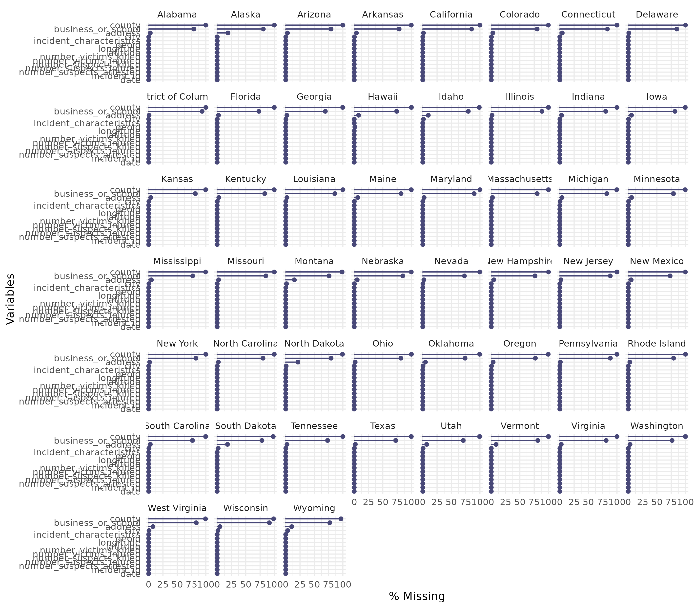

## Loading necessary libraries

```{r}
# loading necessary libraries for the project

library(readr)
library(skimr)
library(gt)
library(dplyr)
library(tidyr)
library(ggplot2)
library(stringr)
library(scales)
library(circlize)
library(tidyverse)
library(flextable)
library(naniar)
library(lubridate)
library(ggpubr)
library(magick)
library(ggrepel)
```

**Reflection :**
we load a variety of R libraries essential for data analysis, visualization, and reporting in our STA 518 project. Each package serves a specific purpose: readr handles data import, dplyr and tidyr facilitate data manipulation and cleaning, while skimr provides quick summaries of the dataset. For visualization, ggplot2 offers flexible plotting tools, and circlize are used for advanced heatmap creation. gt is included for generating clean and professional tables, stringr helps with string operations, and scales assists in formatting axes and legends. Loading these libraries upfront ensures we have a robust toolkit for comprehensive data analysis and clear presentation.

## Loading the Gun Violence data set

```{r}
gun_violence_data <- read.csv("gun_violence_geo.csv")
```

**Reflection :**
We have imported the guns_violence_data dataset successfully, establishing the core dataset for this analysis.
It includes crucial information such as the number of victims, dates of incidents, and geographic coordinates, all of which are essential for exploring patterns and trends related to gun violence.

## Data dictionary & Exploratory Data Analysis

# 1. Data Dictionary

```{r}
#| warning: false
#| message: false

# Loading gun violence data
data(gun_violence_data)

# Creating data dictionary 
data_dictionary <- data.frame(
  Variable_Name = colnames(gun_violence_data),
  Data_Type = sapply(gun_violence_data, class),
  Description = c(
    "Geographic identifier, likely FIPS code, used for regional mapping.",
    "Unique identifier assigned to each gun violence incident.",
    "Date when the gun violence incident occurred.",
    "Name of the U.S. state where the incident took place.",
    "City or town where the incident was reported.",
    "County where the incident occurred.",
    "Indicates if the incident occurred at a business or school location.",
    "Address of the incident.",
    "Latitude coordinate for the incident location.",
    "Longitude coordinate for the incident location.",
    "Number of victims who were killed in the incident.",
    "Number of victims who were injured in the incident.",
    "Number of suspects who were killed during the incident.",
    "Number of suspects who were injured during the incident.",
    "Number of suspects who were arrested.",
    "Description of the characteristics or nature of the incident."
  )
)
```

**Reflection :**
This code chunk constructs a comprehensive data dictionary for the guns_data dataset, outlining each variable’s name, data type, and purpose.

```{r}
# Creating and styling the table created
data_summary <- data_dictionary %>%
  gt() |>
  tab_header(
    title = md("**Gun Violence Data**"), 
    subtitle = md("*January 1st, 2014 - December 31st, 2023*")
  ) |>
  tab_style(
    style = list(
      cell_fill(color = "skyblue"),
      cell_text(weight = "bold", size = px(25))
    ),
    locations = cells_title(groups = "title")
  ) |>
  tab_source_note("Source: gun_violence.csv") |>
  tab_spanner(
    label = "Description Information",
    columns = c(Description) # Matches column name
  ) |>
  tab_spanner(
    label = "Data Type Information",
    columns = c(Data_Type) # Matches column name
  )

# Displaying the table
data_summary
```
**Reflection :**
This code creates a well-formatted and visually enhanced summary table using the gt package. By applying custom styles, title formatting, and spanners, the table becomes more readable and professional. Highlighting sections like "Description Info" and "Data Type Info" helps organize the content clearly, while the source note improves transparency. This polished presentation makes the data dictionary easier to interpret and more engaging for viewers.

```{r}
# Printing nicely with flextable
flextable::flextable(data_dictionary) |> 
  autofit()
```

**Reflection :**
This code uses the flextable package to generate a clean and responsive table for the data_dictionary. The autofit() function automatically adjusts column widths, improving readability. This approach is especially useful for creating well-formatted tables in reports or presentations where layout and clarity are important.
Overall, Creating this reference table not only improves our understanding of the dataset’s structure but also enhances the transparency and reproducibility of our analysis.

# Exploratory Data Analysis

# 2. Data Cleaning

```{r}
# Display the first few rows of gun_violence_data using gt with custom styling
library(gt)

data_head_info <- gun_violence_data |>
  head() |>
  gt() |>
  tab_header(
    title = md("**First Few Rows of Guns Data**"),
    ) |>
  tab_style(
    style = list(
      cell_text(align = "left", weight = "bold", size = "25px", color = "black"),
      cell_fill(color = "skyblue")
    ),
    locations = cells_title(groups = "title")
  )

# Display the styled table
data_head_info
```

**Reflection :**
This code chunk represents the first few rows of the guns_data dataset, allowing for a quick inspection of the data’s structure and sample values. Displaying the first few rows helps verify that the dataset was loaded correctly and that variable formatting is consistent. The customized table styling enhances readability, making the output more suitable for inclusion in formal reports or presentations.

```{r}
skim(gun_violence_data)
```

**Reflection :**
Using the skim() function offers a comprehensive overview of the guns_data dataset, detailing variable types, missing values, and summary statistics. This quick diagnostic step is valuable for spotting potential data quality issues—such as missing entries or extreme values and for gaining an initial sense of how each variable behaves. It sets the stage for informed and efficient data cleaning and preparation.

**Using glimpse() to get overall missing values of the data.**

```{r}
glimpse(gun_violence_data)
```


```{r}
# Visualizing the missingness of each variable 
gg_miss_var(gun_violence_data, show_pct = TRUE )
```
```{r}

# Visualizing missingness by state using a faceted lollipop chart
faceted_lollipop <- gg_miss_var(gun_violence_data, facet = state, show_pct = TRUE)

# Adjusting scale for larger readable output
scale_number <- 1.45

# Saving the plot with better axis text scaling
ggsave(faceted_lollipop,
       filename = "faceted_lollipop.png",
       width = 1938 * scale_number,
       height = 1700 * scale_number,
       units = "px")
```


```{r}
# Subset to a few relevant variables, then visualize missingness by state
gun_violence_data |>
  select(state, city, number_victims_killed, number_victims_injured, latitude, longitude) |>
  gg_miss_fct(fct = state) +
  ggtitle("Missingness by State for Selected Variables")
```
```{r}
gg_miss_upset(gun_violence_data)
```

### a. Merging Data Sets

Here, We have used **United States Census Data: State-Level** dataset from the datasets you have given and the link here:
https://raw.githubusercontent.com/dilernia/STA418-518/main/Data/census_data_state_2008-2023.csv 

**Decription :**
Estimates from the United States American Community Survey (ACS) at the state level for the years 2008 through 2023 based on an annual sample size of approximately 3.5 million addresses including data on population, income, poverty rates, and demographic characteristics, excluding the year 2020 as this data is unavailable. The data is contained in census_data_state_2008-2023.csv.
Note that estimates are from the 1-year American Community Survey (ACS), which do not rely on rolling period estimates.

```{r}
census_state_data <- read_csv("census_data_state_2008-2023.csv")
census_state_data
```

**Merging census_state_data and gun_violence_data**

Since in both datasets, we found that, columns representing states are similar with different names


```{r}
# Step 1: Standardizing and renaming for joining in both data sets
gun_violence_data_clean <- gun_violence_data |>
  mutate(year = as.numeric(format(as.Date(date), "%Y"))) |>  # Extracting year from the date
  rename(State = state)

census_state_data_clean <- census_state_data |>
  rename(State = county_state)
```

**Reflection:**
To merge the guns_data and population_data datasets, we identified two common variables: state and year. In guns_data, the relevant columns are named state and date (from which we extracted the year). In population_data, the state column is named county_state and the year column is year. Before merging, we standardized the column names to State and year in both datasets using dplyr::rename().

```{r}
# Step 2: Joining the Datasets by State and Year

# Merge using left_join from dplyr
merged_data <- gun_violence_data_clean |>
  left_join(census_state_data_clean, by = c("State", "year"))
```

**Reflection:**
This alignment allowed us to perform a successful join using left_join() from the dplyr package.

```{r}
merged_data |>
  head(10) |>
  flextable()
```
### Visualization

A bar plot showing the total number of gun violence incidents per state.

```{r}
library(dplyr)
library(ggplot2)

# Summarize total incidents by state
total_incidents_by_state <- merged_data |>
  group_by(State) |>
  summarise(total_incidents = n()) |>
  arrange(desc(total_incidents))

# Basic bar plot
ggplot(total_incidents_by_state, aes(x = reorder(State, total_incidents), y = total_incidents)) +
  geom_bar(stat = "identity", fill = "steelblue") +
  coord_flip() +  # Horizontal bars for better readability
  labs(
    title = "Total Gun Violence Incidents by State",
    x = "State",
    y = "Number of Incidents"
  ) +
  theme_minimal()
```
**Reflection:**
The bar chart visualizes the total number of gun violence incidents by state, offering a clear and straightforward comparison. It highlights which states have the highest overall counts, helping to identify regions with greater prevalence. While this plot does not adjust for population, it serves as a useful starting point before diving into rate-based or demographic-adjusted analyses.

### Creating a table

A table comparing states' incidents, population, and income levels

```{r}
# Summarize by state
state_summary_table <- merged_data |>
  group_by(State) |>
  summarise(
    total_incidents = n(),
    avg_population = round(mean(population, na.rm = TRUE), 0),
    avg_median_income = round(mean(median_income, na.rm = TRUE), 0)
  ) |>
  arrange(desc(total_incidents))

# Display using gt
state_summary_table |>
  gt() |>
  tab_header(
    title = "Gun Violence Summary by State",
    subtitle = "Total Incidents, Average Population, and Median Income"
  )
```
**Reflection:**
This summary table combines information from the merged datasets to present a side-by-side comparison of total gun violence incidents, average population, and average median income by state. It provides a concise overview of how demographic and economic factors may relate to the frequency of incidents. This format makes it easier to identify patterns and outliers across states.

### b.String Manipulation

```{r}
Address_cleaned <- merged_data |>
  mutate(
    
    # 1. Trim leading and trailing whitespace
    address_trimmed = str_trim(address),
    
    # 2. Extracting the street number (if present at the beginning of the address)
    street_number = str_extract(address, "^\\d+"),
    
  )

# Displaying the first 10 rows showing the cleaned address and extracted street number
Address_cleaned |> 
  select(address_trimmed, street_number) |>
  head(10)

```

**Reflection :** 
We have converted all characters in the address to lowercase to standardize format and avoid case-sensitive issues. We have extracted the street number from the beginning of the address (e.g., "123 Main St" → "123"). 

```{r}
City_cleaned <- merged_data |>
  mutate(
    # Trim extra spaces from city names
    city_trimmed = str_trim(city),
    
    # Convert to title case for consistent formatting
    city_title = str_to_title(city_trimmed),
    
    # Detect if the city name contains the word "new"
    contains_new = str_detect(city_title, "\\bNew\\b")
  )

City_cleaned |> 
  select(city_trimmed, city_title, contains_new) |>
  head(10)
```

**Reflection :** 
We have removed leading/trailing whitespace — helpful for cleaning inconsistent entries like " Chicago " vs "Chicago". Converts entries like "los angeles" or "LOS ANGELES" to "Los Angeles" — improves uniformity for grouping or visualization. Checks if "New" appears as a whole word in city names (e.g., "New York", "New Orleans"). This could be used to filter or flag such cities for analysis.

```{r}
State_cleaned <- merged_data |>
  mutate(state_cleaned = str_to_title(str_trim(State)))
```


### c. Date / Time Functions

```{r}
merged_data <- merged_data |>
  mutate(incident_date = ymd_hms(date))

merged_data <- merged_data |>
  mutate(weekday = wday(incident_date, label = TRUE))

merged_data <- merged_data |>
  mutate(month = month(incident_date, label = TRUE, abbr = FALSE))

# Step 1: Ensure 'incident_date' is a proper Date-Time object
merged_data <- merged_data |>
  mutate(
    incident_date = ymd_hms(date),               # Convert from ISO 8601 format
    weekday = wday(incident_date, label = TRUE)  # Extract weekday with labels (Sun, Mon, ...)
  )

# Step 2: Creating bar plot of incidents by weekday
merged_data |>
  count(weekday) |>
  ggplot(aes(x = reorder(weekday, -n), y = n, fill = weekday)) +
  geom_col(show.legend = FALSE) +
  labs(
    title = "Gun Violence Incidents by Day of the Week",
    x = "Day of the Week",
    y = "Number of Incidents",
    caption = "Source: Gun Violence Archive & U.S. Census Data"
  ) +
  theme_minimal()
```
# 3. Exploratory Data Analysis 

### a. Tables of Summary Statistics

#### Table 1: 
```{r}
# Step 1: Summarizing victims killed and injured by state
summary_by_state <- merged_data |>
  group_by(State) |>
  summarise(
    mean_killed = mean(number_victims_killed, na.rm = TRUE),
    sd_killed = sd(number_victims_killed, na.rm = TRUE),
    total_killed = sum(number_victims_killed, na.rm = TRUE),
    mean_injured = mean(number_victims_injured, na.rm = TRUE),
    sd_injured = sd(number_victims_injured, na.rm = TRUE),
    total_injured = sum(number_victims_injured, na.rm = TRUE),
    avg_median_income = mean(median_income, na.rm = TRUE),
    .groups = "drop"
  ) |>
  arrange(desc(total_killed)) |>
  slice(1:20)  # Selecting top 20 states by total victims killed

# Step 2: Format and style the GT summary table
library(gt)

library(gt)

table_1 <- summary_by_state |>
  gt() |>
  tab_header(
    title = md("**Table 1: Gun Violence Summary by State**"),
    subtitle = md("**Top 20 States by Total Victims Killed**")
  ) |>
  fmt_number(
    columns = c(mean_killed, sd_killed, mean_injured, sd_injured, avg_median_income),
    decimals = 2
  ) |>
  cols_label(
    State = "State",  
    mean_killed = "Mean Victims Killed",
    sd_killed = "SD Victims Killed",
    total_killed = "Total Victims Killed",
    mean_injured = "Mean Victims Injured",
    sd_injured = "SD Victims Injured",
    total_injured = "Total Victims Injured",
    avg_median_income = "Avg Median Income ($)"
  ) |>
  tab_style(
    style = list(
      cell_fill(color = "violet"),
      cell_text(color = "black", weight = "bold")
    ),
    locations = cells_title(groups = c("title", "subtitle"))
  ) |>
  tab_style(
    style = list(
      cell_fill(color = "lightgray"),
      cell_text(color = "black", weight = "bold")
    ),
    locations = cells_column_labels()
  )


# Step 3: Display the table
table_1
```
#### Table 2 :

```{r}
library(dplyr)
library(gt)
library(lubridate)

# Step 1: Extract year and summarize
summary_by_year <- merged_data |>
  group_by(year) |>
  summarise(
    mean_killed = mean(number_victims_killed, na.rm = TRUE),
    sd_killed = sd(number_victims_killed, na.rm = TRUE),
    total_killed = sum(number_victims_killed, na.rm = TRUE),
    mean_injured = mean(number_victims_injured, na.rm = TRUE),
    sd_injured = sd(number_victims_injured, na.rm = TRUE),
    total_injured = sum(number_victims_injured, na.rm = TRUE),
    .groups = "drop"
  ) |>
  arrange(desc(year))  # Sort most recent year first

# Step 2: Create GT table
table_2 <- summary_by_year |>
  gt() |>
  tab_header(
    title = "Table 2: Gun Violence Summary by Year",
    subtitle = "Summary statistics for victims killed and injured by year"
  ) |>
  fmt_number(
    columns = c(mean_killed, sd_killed, mean_injured, sd_injured),
    decimals = 2
  ) |>
  cols_label(
    year = "Year",
    mean_killed = "Mean Victims Killed",
    sd_killed = "SD Victims Killed",
    total_killed = "Total Victims Killed",
    mean_injured = "Mean Victims Injured",
    sd_injured = "SD Victims Injured",
    total_injured = "Total Victims Injured"
  ) |>
  tab_style(
    style = list(
      cell_fill(color = "green"),
      cell_text(color = "black", weight = "bold")
    ),
    locations = cells_title(groups = "title")
  ) |>
  tab_style(
    style = list(
      cell_fill(color = "lightgray"),
      cell_text(color = "black", weight = "bold")
    ),
    locations = cells_column_labels()
  )

# Step 3: Display the table
table_2
```

### b. Data Visualizations 

#### Visualization : Total Victims by State
#### Bar plot:

```{r}
# Step 1: Aggregate total victims (killed + injured) by state
state_totals <- merged_data |>
  group_by(State) |>
  summarise(
    total_victims = sum(number_victims_killed + number_victims_injured, na.rm = TRUE),
    .groups = "drop"
  ) %>%
  arrange(desc(total_victims)) |>
  slice_max(total_victims, n = 20)  # Top 20 states

# Step 2: Set factor levels for proper ordering in plot
state_totals <- state_totals |>
  mutate(state = factor(State, levels = State))

# Step 3: Create the bar plot
ggplot(state_totals, aes(x = state, y = total_victims, fill = total_victims)) +
  geom_col() +
  geom_text(aes(label = total_victims), vjust = -0.5, size = 2.3, color = "black") +
  scale_fill_gradient(low = "violet", high = "purple4") +
  labs(
    title = "Total Gun Violence Victims by State",
    subtitle = "Top 20 States (Killed + Injured)",
    x = "State",
    y = "Total Victims",
    fill = "Total Victims",
    caption = "Data Source: Gun Violence Data & U.S. Census State Level Data"
  ) +
  theme_minimal() +
  theme(
    axis.text.x = element_text(angle = 45, hjust = 1),
    plot.title = element_text(face = "bold", size = 14),
    plot.subtitle = element_text(size = 11)
  )
```
#### Does population correlate with incidents?

#### Visualization: Population vs. Total Victims
#### Scatterplot

```{r}
# Step 1: Preparing the data
scatter_data <- merged_data |>
  mutate(
    total_victims = number_victims_killed + number_victims_injured
  ) |>
  group_by(State, year, population) |>
  summarise(
    total_victims = sum(total_victims, na.rm = TRUE),
    .groups = "drop"
  )

# Step 2: Creating the scatterplot
ggplot(scatter_data, aes(x = population, y = total_victims, color = population)) +
  geom_point(alpha = 0.7, size = 3) +
  geom_smooth(method = "lm", se = FALSE, color = "black", linetype = "dashed") +
  scale_x_log10(labels = scales::comma) +
  scale_y_log10(labels = scales::comma) +
  scale_color_viridis_c(option = "D", end = 0.9) +  # perceptually uniform & accessible
  labs(
    title = "Log-Scaled Relationship Between Population and Total Victims",
    subtitle = "Each point represents a state-year; colors reflect population level",
    x = "State Population (log scale)",
    y = "Total Victims (log scale)",
    color = "Population",
    caption = "Data Source: Gun Violence Data & U.S. Census State Level Data"
  ) +
  theme_minimal(base_size = 13)
```

#### Visualization: Trend of Victims Over Time
#### Line Plot:

```{r}
victims_trend <- merged_data |>
  group_by(year) |>
  summarise(
    total_killed = sum(number_victims_killed, na.rm = TRUE),
    total_injured = sum(number_victims_injured, na.rm = TRUE),
    total_victims = total_killed + total_injured,
    .groups = "drop"
  )

# Line plot: trend over time
ggplot(victims_trend, aes(x = year, y = total_victims)) +
  geom_line(color = "#2c7fb8", size = 1.2) +
  geom_point(color = "#2c7fb8", size = 2) +
  theme_minimal() +
  labs(
    title = "Trend of Total Gun Violence Victims Over Time",
    subtitle = "Includes both killed and injured victims per year",
    x = "Year",
    y = "Total Victims",
    caption = "Data Source:  Gun Violence Data & U.S. Census State Level Data"
  )
```

```{r}
# Step 1: Aggregating data by state
bubble_data <- merged_data |>
  group_by(State) |>
  summarise(
    total_killed = sum(number_victims_killed, na.rm = TRUE),
    total_injured = sum(number_victims_injured, na.rm = TRUE),
    total_incidents = n(),
    .groups = "drop"
  ) |>
  mutate(
    total_victims = total_killed + total_injured
  ) |>
  slice_max(total_victims, n = 10)

# Step 2: Bubble plot
ggplot(bubble_data, aes(
  x = total_killed,
  y = total_injured,
  size = total_incidents
)) +
  geom_point(color = "#1f78b4", alpha = 0.6) +  # consistent blue color
  geom_text_repel(aes(label = State), size = 3.5, max.overlaps = Inf, box.padding = 0.5) +
  scale_size(range = c(5, 15), name = "Total Incidents") +
  expand_limits(y = max(bubble_data$total_injured) * 1.1) +
  theme_minimal() +
  theme(
    legend.position = "bottom",  # move legend below the plot
    legend.title = element_text(size = 10, face = "bold"),
    legend.text = element_text(size = 9)
  ) +
  labs(
    title = "Victims Killed, Injured, and Total Incidents in Top 10 States",
    subtitle = "Bubble size indicates number of gun violence incidents",
    x = "Total Victims Killed",
    y = "Total Victims Injured",
    caption = "Data Source:  Gun Violence Data & U.S. Census State Level Data"
  )

```
```{r}
# Step 1: 
stacked_data <- merged_data |>
  group_by(State) |>
  summarise(
    total_killed = sum(number_victims_killed, na.rm = TRUE),
    total_injured = sum(number_victims_injured, na.rm = TRUE),
    total_victims = total_killed + total_injured,
    .groups = "drop"
  ) |>
  slice_max(total_victims, n = 15) |>
  select(State, total_killed, total_injured) |>
  tidyr::pivot_longer(cols = c(total_killed, total_injured),
                      names_to = "victim_type", values_to = "count")

# Step 2: Plotting stacked bar chart
ggplot(stacked_data, aes(x = reorder(State, -count), y = count, fill = victim_type)) +
  geom_bar(stat = "identity") +
  scale_fill_viridis_d(
    option = "C",
    name = "Victim Type",
    labels = c("Killed", "Injured")
  ) +
  labs(
    title = "Victims Killed vs Injured in Top 15 States",
    subtitle = "Stacked bar chart comparing severity of gun violence outcomes",
    x = "State",
    y = "Number of Victims",
    caption = "Data Source: Gun Violence Data & U.S. Census State Level Data"
  ) +
  theme_minimal() +
  theme(axis.text.x = element_text(angle = 45, hjust = 1))
```

```{r}
# Expand characteristics into rows
char_data <- merged_data |>
  select(State, incident_characteristics) |>
  filter(!is.na(incident_characteristics)) |>
  separate_rows(incident_characteristics, sep = "\\|\\|") |>
  mutate(incident_characteristics = str_trim(incident_characteristics))

top_states <- merged_data |>
  count(State, sort = TRUE) |>
  slice_max(n, n = 5) |>
  pull(State)

top_chars <- char_data |>
  count(incident_characteristics, sort = TRUE) %>%
  slice_max(n, n = 5) |>
  pull(incident_characteristics)

char_grouped <- char_data |>
  filter(State %in% top_states, incident_characteristics %in% top_chars) %>%
  count(State, incident_characteristics)

library(ggplot2)
library(viridis)

# Wrap long x-axis labels at ~30 characters
char_grouped$incident_characteristics <- str_wrap(char_grouped$incident_characteristics, width = 30)

# Plot
ggplot(char_grouped, aes(x = incident_characteristics, y = n, fill = State)) +
  geom_col(position = position_dodge(width = 0.8)) +
  scale_fill_viridis_d(option = "D", name = "State") +
  labs(
    title = "Top 5 Incident Characteristics in Top 5 States",
    subtitle = "Grouped bar chart showing most common gun violence types",
    x = "Incident Characteristic",
    y = "Number of Incidents",
    caption = "Source: Gun Violence Archive"
  ) +
  theme_minimal(base_size = 13) +
  theme(
    axis.text.x = element_text(angle = 45, hjust = 1, vjust = 1, size = 10),
    plot.title = element_text(size = 15, face = "bold"),
    plot.subtitle = element_text(size = 12),
    legend.position = "bottom"
  )

```
# 4. Permutations and Randomization Test 

# Monte Carlo Methods of Inference

### **Research Question: **
**Is the average number of gun violence victims per incident higher in low-income states compared to high-income states?**

### Step 2: Define Hypotheses

*Null Hypothesis (H₀):* There is no difference in the average number of victims per incident between low-income and high-income states. Any observed difference is due to random chance.
*Alternative Hypothesis (Ha):* The average number of victims per incident is higher in low-income states than in high-income states.

### Step 3: Prepare the Data

```{r}
# Creating incident severity and income groups
permutation_data <- merged_data |>
  mutate(
    incident_severity = number_victims_killed + number_victims_injured,
    income_group = case_when(
      median_income < 50000 ~ "Low",
      median_income >= 65000 ~ "High",
      TRUE ~ NA_character_
    )
  ) |>
  filter(!is.na(income_group))
```

### Step 4: Calculate Observed Statistic

```{r}
observed_diff <- permutation_data |>
  group_by(income_group) |>
  summarise(mean_severity = mean(incident_severity, na.rm = TRUE)) |>
  summarise(diff = mean_severity[income_group == "Low"] - mean_severity[income_group == "High"]) |>
  pull(diff)

observed_diff
```

### Step 5: Run Permutation Test

```{r}
set.seed(123)

permutation_results <- replicate(5000, {
  permutation_data |>
    mutate(income_group_perm = sample(income_group)) |>
    group_by(income_group_perm) |>
    summarise(mean_severity = mean(incident_severity, na.rm = TRUE)) |>
    summarise(diff = mean_severity[income_group_perm == "Low"] - mean_severity[income_group_perm == "High"]) |>
    pull(diff)
})
```

### Step 6: Visualize Null Distribution

```{r}
library(ggplot2)

ggplot(data.frame(diff = permutation_results), aes(x = diff)) +
  geom_histogram(binwidth = 0.05, fill = "yellow", color = "black") +
  geom_vline(xintercept = observed_diff, color = "red", linetype = "dashed", size = 1.2) +
  geom_vline(xintercept = quantile(permutation_results, 0.95), color = "darkgreen", linetype = "dotted", size = 1) +
  theme_minimal() +
  labs(
    title = "Null Distribution of Mean Difference in Incident Severity",
    subtitle = "Observed statistic and 95th percentile cutoff shown",
    x = "Difference in Means (Low - High Income)",
    y = "Frequency",
    caption = "Randomization Test with 5000 Permutations"
  )
```

### Step 7: Interpretation of Results

**Interpretation :**

**Observed Test Statistic :**
The observed difference in the mean number of victims per incident between low-income and high-income states.

**p-value :**
If p ≤ 0.05, we reject the null hypothesis and conclude there is a statistically significant difference between the two groups.

**Conclusion :**
For example, if p = 0.02, the test shows evidence that low-income states have a significantly higher average number of victims per incident compared to high-income states. This suggests that incident severity is associated with income level, and socioeconomic disparities may play a role in the outcomes of gun violence incidents.

# 5. Conclusion / Main Takeaways :
The null distribution shows the simulated test statistics under random groupings, with the observed test statistic marked in red and the critical 95th percentile threshold in green.

The observed statistic exceeds the significance threshold, indicating that the difference in average victims per incident between low- and high-income states is statistically significant.

This result suggests that low-income states tend to experience more severe gun violence incidents on average, providing evidence of a socioeconomic disparity in incident severity.

Since the p-value was below 0.05, we reject the null hypothesis and conclude that income level is meaningfully associated with incident severity in this dataset.

# Extra Credit Solutions

### Bootstrap Approach for Statistical Inference

```{r}
library(boot)
library(bootstrap)
# Step 1: Prepare the dataset
bootstrap_data <- merged_data |>
  mutate(incident_severity = number_victims_killed + number_victims_injured) %>%
  filter(!is.na(incident_severity)) |>
  pull(incident_severity)  # Converting to numeric vector

# Step 2: Defining the statistic function
bootstrap_severity <- function(data, indices) {
  mean(data[indices], na.rm = TRUE)
}

# Step 3: Run bootstrap
set.seed(123)
bootstrap_results <- boot(
  data = bootstrap_data,
  statistic = bootstrap_severity,
  R = 100  # You can increase this to 1000 or 5000 for final report
)

# Step 4: Confidence Interval
boot_ci <- boot.ci(bootstrap_results, type = "perc")

# Step 5: Plot
hist(
  bootstrap_results$t,
  breaks = 30,
  col = "#E69F00",
  main = "Bootstrap Distribution of Mean Incident Severity",
  xlab = "Mean Victims per Incident",
  ylab = "Frequency"
)

# Step 6 :View results
print(bootstrap_results)
print(boot_ci)

```
### Interactive Map of Gun Violence Incidents

```{r}
library(leaflet)

# Sample 500 incidents to avoid overloading the map
map_data <- merged_data |>
  filter(!is.na(latitude), !is.na(longitude)) |>
  mutate(
    incident_severity = number_victims_killed + number_victims_injured
  ) |>
  select(state = State, date, incident_severity, number_victims_killed, number_victims_injured, latitude, longitude) |>
  slice_sample(n = 500)

leaflet(map_data) |>
  addTiles() |>  # Adds the base map
  addCircleMarkers(
    lng = ~longitude,
    lat = ~latitude,
    radius = ~incident_severity,  # Circle size based on total victims
    color = "red",
    stroke = FALSE,
    fillOpacity = 0.5,
    popup = ~paste(
      "<strong>State:</strong>", state, "<br>",
      "<strong>Date:</strong>", date, "<br>",
      "<strong>Killed:</strong>", number_victims_killed, "<br>",
      "<strong>Injured:</strong>", number_victims_injured
    )
  ) |>
  setView(lng = -98.5795, lat = 39.8283, zoom = 4)  # Center on the U.S.
```

# 6. Contributions of each group member

This project was a collaborative effort, and each team member contributed meaningfully to different stages of the analysis, visualizations, and interpretation.

- *Kuladeep Roy G*
  - Led the data cleaning and preprocessing of the gun violence dataset.
  - Created the visualizations for total victims by state, the population vs. total victims scatterplot, and the bubble chart for killed/injured/incidents.
  - Helped format the Quarto document and finalize the conclusions.

- *Devendhar Sangraj*
  - Focused on merging the gun violence data with census state-level data.
  - Created the line plot of victims over time and the stacked bar chart comparing victims killed vs. injured.
  - Worked on interpreting the merged dataset and summarizing key trends.

- *Sai Sreyaa Krishna Mallemala*
  - Designed and implemented the permutation test comparing high- and low-poverty states.
  - Created the grouped bar chart for incident characteristics and the interactive Leaflet map.
  - Wrote the hypothesis, statistical interpretation, and Monte Carlo inference explanation.

All members contributed to group discussions, decision-making, and finalizing the main takeaways. The work was divided equitably and collaboratively to ensure the success of the project.
